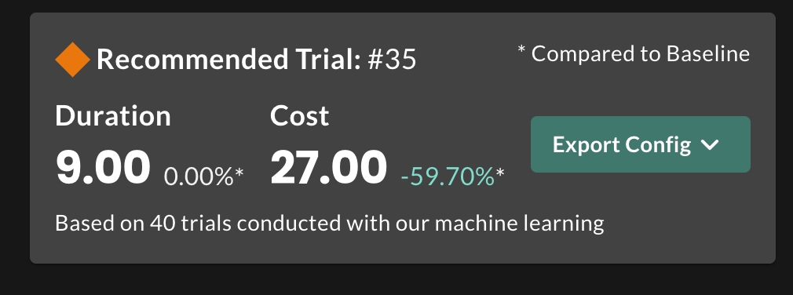
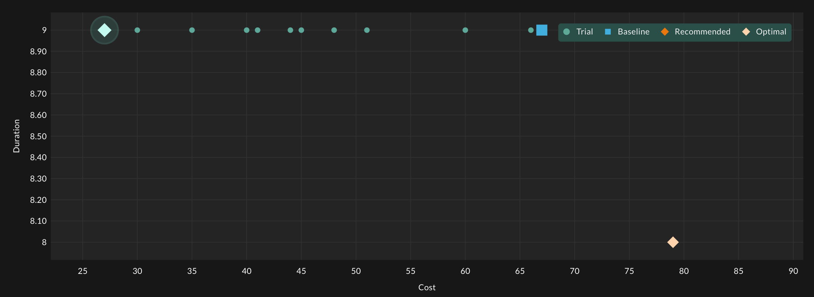
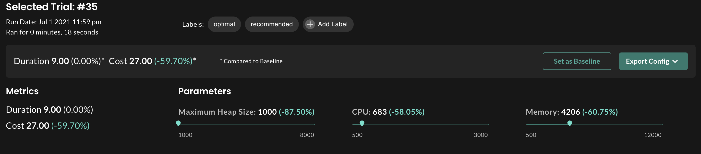

# Cassandra StormForge Example

Optimizing Cassandra for Cost and Performance using cassandra-stress

## Overview

As companies start using containerized versions of Cassandra, it can be challenging to tune the environment Cassandra is operating in
for things like HEAP size, CPU, Memory, etc. Due to this challenge, companies are scaling their infrastucture out to keep up with 
the demand of Cassandras increasing resource demand in order to remain stable. In this example we show how to use cassandra-stress, the
apache cassandra load testing utility to run all three stress tests consecutively - Write, Read, Mixed.

The official documentation for cassandra-stress can be found [here](https://cassandra.apache.org/doc/latest/tools/cassandra_stress.html)

### Technical Process

In order to get the cassandra-stress to run all three load tests under one experiment trial, we needed to create a container for that task.
You can find the Dockerfile and related artifacts [here](https://www.github.com/thecrudge/cstress) or in the Docker folder. Essentially its
an image that runs an entrypoint with a very basic script to run all three load tests consecutively. You can customize your load test parameters
here in the entrypoint.sh file.

In the experiment spec, you can see the parameters we are using for our experiment, and the experiment budget (or how many trials we want to run) -

```yaml
spec:
  optimization:
  - name: "experimentBudget"
    value: "120" #number of trials 
  parameters:
  - name: memory
    min: 500
    max: 12000
  - name: cpu
    min: 500
    max: 3000
  - name: MAX_HEAP_SIZE
    min: 1000
    max: 8000
```

It is important to remember here to leave some headroom for the max config so not to run into OOM or resource issues during the trial. Here
I am running Cassandra in AWS on ec2, t2.xlarge nodes.

Because we never want our HEAP size to be greater than our memory setting, we can configure this in our experiment file by declaring constraints
like so -

```yaml
  constraints:
  - order:
      lowerParameter: MAX_HEAP_SIZE
      upperParameter: memory
```

You can also see that we did the same thing here, but defined them in a different way so that MAX_HEAP_SIZE remains 1500M below memory.

You can find documentation on constraints [here](https://docs.stormforge.io/optimize-pro/reference/parameters/#parameter-constraints)

```yaml
  constraints:
  - name: heap_memory
    isUpperBound: true
    bound: "-1500"
    constraintType: sum
    parameters:
    - parameterName: memory
      weight: "-1.0"
    - parameterName: MAX_HEAP_SIZE
      weight: "1.0"
```

Next, we need to define our metrics or objectives we are optimizing for -

```yaml
  metrics:
  - name: duration
    minimize: true
    query: "{{duration .StartTime .CompletionTime}}"
  - name: cost
    minimize: true
    query: "{{div (add (mul .Values.cpu 22) (mul .Values.memory 3)) 1000}}"
```

In this example, duration is equal to the amount of time it takes for the cassandra-stress job to complete, and the cost is measured by the 
amount of CPU and Memory we are consuming in that trial.

Finally, we define our patches and our trial template

```yaml
    patch: |
      spec:
        template:
          spec:
            containers:
            - name: cassandra 
              resources:
                limits:
                  cpu: "{{ .Values.cpu }}m"
                  memory: "{{ .Values.memory }}Mi"
                requests:
                  cpu: "{{ .Values.cpu }}m"
                  memory: "{{ .Values.memory }}Mi"
              env:
                - name: MAX_HEAP_SIZE
                  value: "{{ .Values.MAX_HEAP_SIZE }}M"

  trialTemplate:
    spec:
      initialDelaySeconds: 15
      jobTemplate:
        spec:
          template: # pod
            spec:
              containers:
              - image: thecrudge/cstress:latest
                name: cassandra-stress
```

You can see here how we are patching the cassandra containers for limits and env variables for HEAP sizing. You can also see here that we are
using the custom cassandra-stress image we discussed at the beginning of this file. We can validate our trial patch, by descibing a cassandra pod 
and verifying the trial settings by describing the trial -

```terminal
kubectl describe pod cassandra-0
Name:         cassandra-0
...
Containers:
  cassandra:
    Container ID:   docker://835392cb704e7a01c8011c4d69f7b014159a2b3847809f9074689b905f44596e
    Image:          gcr.io/google-samples/cassandra:v13
    Image ID:       docker-pullable://gcr.io/google-samples/cassandra@sha256:7a3d20afa0a46ed073a5c587b4f37e21fa860e83c60b9c42fec1e1e739d64007
    Ports:          7000/TCP, 7001/TCP, 7199/TCP, 9042/TCP
    Host Ports:     0/TCP, 0/TCP, 0/TCP, 0/TCP
    State:          Running
      Started:      Wed, 02 Jun 2021 10:54:42 -0500
    Ready:          True
    Restart Count:  0
    Limits:
      cpu:     618m
      memory:  5049Mi
    Requests:
      cpu:      618m
      memory:   5049Mi
    Readiness:  exec [/bin/bash -c /ready-probe.sh] delay=15s timeout=5s period=10s #success=1 #failure=3
    Environment:
      MAX_HEAP_SIZE:           1413M
      HEAP_NEW_SIZE:           7514M
      CASSANDRA_SEEDS:         cassandra-0.cassandra.default.svc.cluster.local
      CASSANDRA_CLUSTER_NAME:  K8Demo
      CASSANDRA_DC:            DC1-K8Demo
      CASSANDRA_RACK:          Rack1-K8Demo
      POD_IP:                   (v1:status.podIP)
...
```

```terminal
kubectl get trials -w

NAME                                     STATUS      ASSIGNMENTS                                                     VALUES
cassandra-write-read-mixed-example-000   Completed   MAX_HEAP_SIZE=5186, cpu=2309, memory=6622   duration=3411, cost=70
cassandra-write-read-mixed-example-001   Running     MAX_HEAP_SIZE=1413, cpu=618, memory=5049
```

## Results

The image below shows us that the machine learning has recommended trial number #98. With this trial we can see we have a cost savings of 34.29%
compared to our baseline in Trial #1.



In this image, we can see all of our trials, with the recommended trial highlighted.



And finally, we can get the parameter settings or export the config itself


