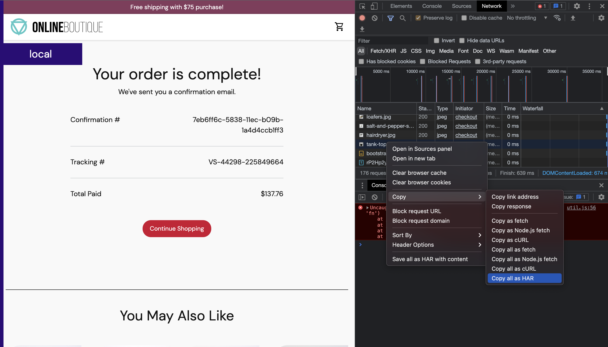

# Optimizing e-commerce site using StormForge performance testing platform

## Overview

The purpose of this example is to show easily you can create and incorporate the StormForge performance test for optimization of a online shop based on the Google Boutique microservices demo. You can find the detailed install intructions to a k8s cluster here: [Google Microservices Demo](https://github.com/GoogleCloudPlatform/microservices-demo).

## Setup

For this example, there are a few things you'll need:

- Access to a working Kubernetes cluster
- Create an account on stormforge.io - [https://app.stormforge.io](https://app.stormforge.io)
- Install StormForge CLI and Controller - [Install docs for stormforge](https://docs.stormforge.io/optimize/getting-started/install/)
- Create an account and organization on stormforger.com - [https://app.stormforger.com](https://app.stormforger.com)
- Install forge CLI - [Install docs for forge CLI](https://docs.stormforger.com/guides/forge-cli/#installation)

## Creating the Load Test

Using the StormForge performance testing platform, you have the ability to record a HAR file from the browser and import that into our platform and use that as a baseline or skaffold for your performace test. In this way, you can define different user journeys and workflows while testing various functions of your application.

You can find detailed instructions on how to create and import a HAR file here: [StormForge HAR Creation](https://docs.stormforger.com/guides/har-converter/)

Alternatively, you can view a video walkthrough for this example here: [StormForge Boutique Walkthrough Example](https://)

In this case, I've opened the developer tools on my Chrome browser, and loaded the Google Boutique. Here, I've added a few items to the cart, and then checked out, so we can get a good representation of a user journey start to finish. This hits most of the microservices in this application, that we will then use in our machine learning platform to optimize.

## Generating the experiment

* Before you start, please follow the instructions from the install docs above, and authenticate to the two platforms

<!--- SHOW HOW USE OF LABELS WORKS IN EXPERIMENT GENERATION -->

## Running the experiment

## Results
