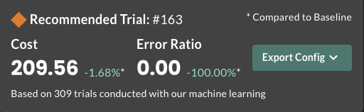
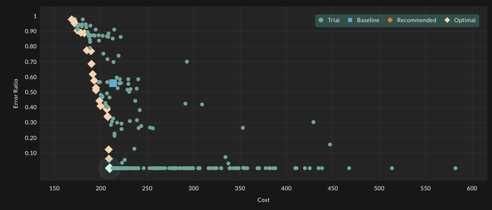
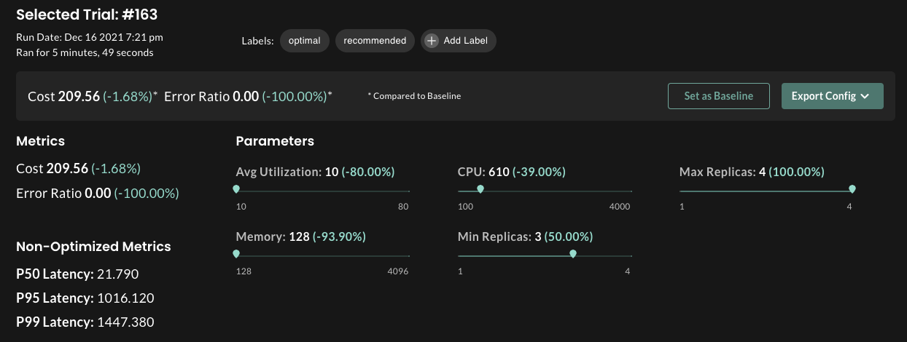

# Voting Webapp with HPA optimized using StormForge Performance Testing

## Overview

The goal of this example is to optimize the [voting webapp](https://github.com/thestormforge/examples/tree/master/voting-webapp) using a [Horizontal Pod Autoscaler (HPA)](https://kubernetes.io/docs/tasks/run-application/horizontal-pod-autoscale/)

In this experiment, the load test is performed by [StormForge Performance Testing](https://www.stormforge.io/performance-testing/). This allows us to better simulate real-life traffic load on the application and show how to carefully tune HPA to identify optimal deployment resource allocations.

## Prerequisites

You must have a Kubernetes cluster. We recommend using a cluster with 4 nodes, 16 vCPUs (4 on each node) and 32GB of memory (8 on each node). Additionally, you will need a local configured copy of `kubectl`.

Additionally, you will need a local configured copy of `kubectl` and to initialize StormForge Optimize in your cluster. You can download a binary for your platform from the [installation guide](https://docs.stormforge.io/optimize/getting-started/install//) and run `stormforge init` (while connected to your cluster).

## Run the experiment
### Deploy the voting webapp with ingress

Because the load test resides outside of the cluster, the voting webapp needs to be exposed with a publicly accessible IP address.

Run:
`kustomize build application | kubectl apply -f -`

Once the IP address for the ingress is available, you can test the website by accessing the IP address in a web browser or using curl.
Write

Once the external IP address for the voting-service is ready, insert it in the `sf-experiment/experiment.yaml` as the value for the `TARGET` env variable.

### Set StormForge Performance Testing credentials
Set StormForge Performance Testing JWT in `sf-experiment/acessToken`
Replace the value of the `TEST_CASE` env variable with your test case e.g.,`my-organization/my-test-case-name`.


### Launch an experiment

Create the RBAC permission
`stormforge generate rbac -f sf-experiment/experiment.yaml | kubectl apply -f -`

Replace the namespace in `sf-experiment/kustomization.yaml` with the namespace in which you want to deploy.

Launch the experiment
`kustomize build sf-experiment | kubectl apply -f`

### Monitor the experiment progress and results

The best way to monitor the experiment progress is to use the [web based dashboard](https://app.stormforge.io/)

You can also access the status of the trials using the `kubectl` command line tool.

```
❯ kubectl get trials
NAME             STATUS      ASSIGNMENTS                                                                 VALUES
hpa-sf-011-000   Completed   memory=2098, cpu=1000, min_replicas=2, max_replicas=2, avg_utilization=50   cost=213.128192, p95-latency=4.96, p50-latency=3.67, p99-latency=6.12, error_ratio=1
hpa-sf-011-001   Completed   avg_utilization=41, cpu=1379, max_replicas=4, memory=1865, min_replicas=4   cost=282.692192, p95-latency=4.96, p50-latency=3.66, p99-latency=6.1, error_ratio=1
hpa-sf-011-002   Completed   avg_utilization=24, cpu=3983, max_replicas=3, memory=3913, min_replicas=1   cost=404.890192, p95-latency=4.96, p50-latency=3.66, p99-latency=6.09, error_ratio=1
hpa-sf-011-003   Completed   avg_utilization=63, cpu=3921, max_replicas=3, memory=550, min_replicas=1    cost=234.847192, p95-latency=4.94, p50-latency=3.64, p99-latency=6.03, error_ratio=1
hpa-sf-011-004   Completed   avg_utilization=68, cpu=423, max_replicas=2, memory=689, min_replicas=2     cost=185.056192, p95-latency=4.96, p50-latency=3.67, p99-latency=6.03, error_ratio=1
hpa-sf-011-005   Completed   avg_utilization=14, cpu=3628, max_replicas=4, memory=375, min_replicas=3    cost=354.94319200000007, p95-latency=4.95, p50-latency=3.66, p99-latency=5.98, error_ratio=1
hpa-sf-011-006   Completed   avg_utilization=68, cpu=3145, max_replicas=3, memory=390, min_replicas=1    cost=330.445192, p95-latency=4.95, p50-latency=3.66, p99-latency=6, error_ratio=1
hpa-sf-011-007   Completed   avg_utilization=53, cpu=4000, max_replicas=3, memory=128, min_replicas=1    cost=234.92419200000003, p95-latency=4.96, p50-latency=3.67, p99-latency=6.05, error_ratio=1
```

## Technical Process
The experiment is fully automated as defined in the experiment.yaml 

In the experiment spec, you can see the parameters we are using for our experiment. 

```
spec:
  parameters:
  - name: memory
    baseline: 2098
    min: 128
    max: 4096
  - name: cpu
    baseline: 1000
    min: 100
    max: 4000
  - name: min_replicas
    baseline: 2
    min: 1
    max: 4
  - name: max_replicas
    baseline: 2
    min: 1
    max: 4
  - name: avg_utilization
    baseline: 50
    min: 10
    max: 80
```


Because it does not make sense for the Machine Learning engine to experiment a deployment where min_replicas is larger than max_replicas, we can provide guidelines to the Machine Learning engine in our experiment file by declaring constraints.

```
  constraints:
  - order:
      lowerParameter: min_replicas
      upperParameter: max_replicas
```

You can find more details on constraints [here](https://docs.stormforge.io/experiment/parameters/#parameter-constraints)

Next, we need to define the metrics or objectives we are optimizing for. 

```
  metrics:
  - name: cost
    type: prometheus
    port: 9090
    minimize: true
    query: ({{ cpuRequests . "" }} * 17) + ({{ memoryRequests . "" | GB }} * 3)
  - name: error_ratio
    type: prometheus
    port: 9090
    minimize: true
    query: scalar(error_ratio{job="trialRun",instance="{{ .Trial.Name }}"})
  - name: p95-latency
    type: prometheus
    port: 9090
    minimize: true
    optimize: false
    query: scalar(percentile_95{job="trialRun",instance="{{ .Trial.Name }}"})
  - name: p50-latency
    type: prometheus
    port: 9090
    minimize: true
    optimize: false
    query: scalar(median{job="trialRun",instance="{{ .Trial.Name }}"})
  - name: p99-latency
    type: prometheus
    port: 9090
    # max: "1000" # RW
    minimize: true
    optimize: false
    query: scalar(percentile_99{job="trialRun",instance="{{ .Trial.Name }}"})
```

Please note that the cost is calculated based on the CPU and Memory consumed in that trial.

Finally, we define our patches and our trial template.

```
  patches:
  - targetRef:
      name: voting-hpa
      apiVersion: autoscaling/v2beta2
      kind: HorizontalPodAutoscaler
    patch: |
      spec:
        maxReplicas: {{ .Values.max_replicas }}
        minReplicas: {{ .Values.min_replicas }}
        metrics:
        - type: Resource
          resource:
            name: cpu
            target:
              type: Utilization
              averageUtilization: {{ .Values.avg_utilization }}
  - targetRef:
      name: voting-service
      apiVersion: apps/v1
      kind: Deployment
    patch: |
      spec:
        template:
          spec:
            containers:
            - name: voting-service
              resources:
                limits:
                  memory: '{{ .Values.memory }}M'
                  cpu: '{{ .Values.cpu }}m'
                requests:
                  memory: '{{ .Values.memory }}M'
                  cpu: '{{ .Values.cpu }}m'

  template: # trial
    spec:
      initialDelaySeconds: 15
      template: # job
        spec:
          template: # pod
            spec:
              containers:
              - image: thecrudge/cstress:latest
                name: cassandra-stress

  trialTemplate:
    metadata:
      labels:
        stormforge.io/application: hpa-sf
        stormforge.io/scenario: standard
    spec:
      jobTemplate:
        metadata:
          labels:
            stormforge.io/application: hpa-sf
            stormforge.io/scenario: standard
        spec:
          template:
            metadata:
              labels:
                stormforge.io/application: hpa-sf
                stormforge.io/scenario: standard
            spec:
              containers:
              - name: stormforger
                image: thestormforge/optimize-trials:v0.0.1-stormforger                
```

You can see here how we are patching the voting-service deployment for CPU and memory allocation as well as the number of replicas for HPA. You can also see here that we use the custom thestormforge/optimize-trials:v0.0.1-stormforger container image for load generation. We can validate our trial patch by describing a voting-service pod and verifying the trial settings by describing the trial 

```                                                                                                                  
kubectl describe pod voting-service-595f79c587-f6fpt
Name:         voting-service-595f79c587-f6fpt
...
Containers:
  voting-service:
    Container ID:   containerd://96d626db8486942208e0d279831088c4c993644f7933a9b3b6b627124b15dae2
    Image:          dockersamples/examplevotingapp_vote
    Image ID:       docker.io/dockersamples/examplevotingapp_vote@sha256:b4e60557febfed6d345a09e5dce52aeeff997b7c16a64428ccf5f3d8f3c60dde
    Port:           80/TCP
    Host Port:      0/TCP
    State:          Running
      Started:      Fri, 17 Dec 2021 09:06:27 -0600
    Ready:          False
    Restart Count:  0
    Limits:
      cpu:     422m
      memory:  380M
    Requests:
      cpu:        422m
      memory:     380M
    Readiness:    http-get http://:80/ delay=5s timeout=1s period=5s #success=1 #failure=3
    Environment:  <none>
    Mounts:
      /var/run/secrets/kubernetes.io/serviceaccount from kube-api-access-6bs7q (ro)
...
```
```
kubectl describe trial hpa-sf-011-008
Name:         hpa-sf-011-008
Namespace:    default
Labels:       stormforge.io/application=hpa-sf
              stormforge.io/experiment=hpa-sf-011
              stormforge.io/scenario=standard
Annotations:  stormforge.io/report-trial-url: https://api.stormforge.dev/v1/experiments/hpa-sf-011/trials/8
API Version:  optimize.stormforge.io/v1beta2
Kind:         Trial
...       5
    Target Ref:
      API Version:  apps/v1
      Kind:         Deployment
      Name:         voting-service
      Namespace:    default
  Start Time:       2021-12-22T23:47:51Z
  Values:           cost=237.33619200000004, p95-latency=4.96, p50-latency=3.67, p99-latency=6.13, error_ratio=1
Events:             <none>
```

## Results
The image below shows us that the Machine Learning engine has recommended trial number #163. With this trial, we can see we have an Error Ratio reduction by 100%
compared to our baseline in Trial #0.



In this image, we can see all of our trials, with the recommended trial highlighted.



And finally, we can get the parameter settings or export the config itself

