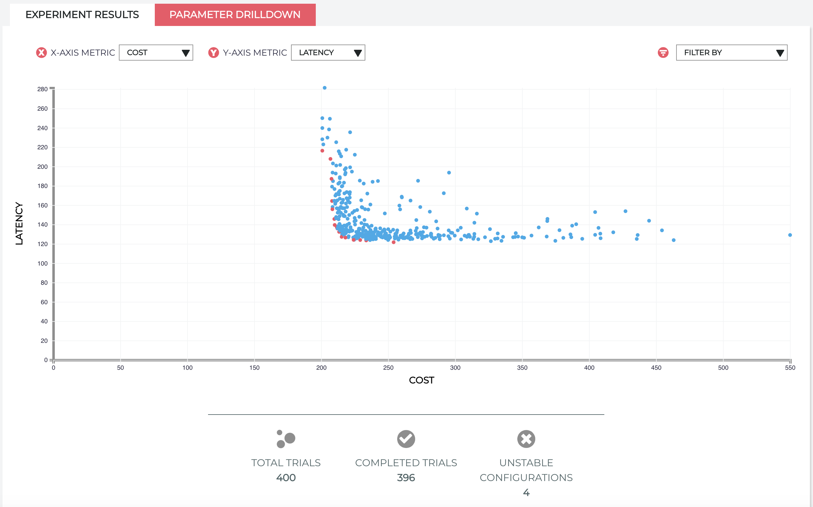

# HPA Example

## Introduction

The goal of this recipe is to optimize the [voting webapp](https://github.com/redskyops/redskyops-recipes/tree/master/voting-webapp) using a [Horizontal Pod Autoscaler (HPA)](https://kubernetes.io/docs/tasks/run-application/horizontal-pod-autoscale/) for scaling up and down the `voting-service` deployment during a trial (load test).

## Prerequisites

You must have a Kubernetes cluster. We recommend using a cluster with 4 nodes, 16 vCPUs (4 on each node) and 32GB of memory (8 on each node). Additionally, you will need a local configured copy of `kubectl`.

A local install of [Kustomize](https://github.com/kubernetes-sigs/kustomize/releases) (v3.1.0+) is required to manage the objects in you cluster.

Additionally, you will to initialize Red Sky Ops (v1.6.4+) in your cluster. You can download a binary for your platform from the [releases page](https://github.com/redskyops/redskyops-controller/releases) and run `redskyctl init` (while connected to your cluster). For more details, see [the installation guide](https://redskyops.dev/docs/install/).

To allow the controller to patch the deployments and the HPA during the experiment, generate the proper RBAC permissions by running the following:
`redskyctl generate rbac -f experiment.yaml | kubectl apply -f -`

The `experiment.yaml` file is the actual experiment object manifest; this includes the definition of the experiment itself (in terms of assignable parameters and observable metrics) and the instructions for carrying out the experiment (in terms of load generation, configured in `trialjob_configmap.yaml`, and metric queries). Here is where you may change parameter ranges and the experiment name (to avoid experiment name conflicts in the cluster).

## Experiment lifecycle

For each trial, we create a locust load test for the configuration tested using the following trial pod:

```
          template: # pod
            spec:
              containers:
              - name: locust-trial-job
                image: broadinstitute/python-requests
                command: ["python", "/home/load_test.py"]
                env:
                - name: LOCUST_HOST
                  valueFrom:
                    configMapKeyRef:
                      name: trialjob-env
                      key: locust_host
                - name: N_CLIENTS
                  valueFrom:
                    configMapKeyRef:
                      name: trialjob-env
                      key: n_clients
                - name: HATCH_RATE
                  valueFrom:
                    configMapKeyRef:
                      name: trialjob-env
                      key: hatch_rate
                - name: RUN_TIME
                  valueFrom:
                    configMapKeyRef:
                      name: trialjob-env
                      key: run_time
                - name: MAX_LATENCY # max avg latency in ms
                  valueFrom:
                    configMapKeyRef:
                      name: trialjob-env
                      key: max_latency
                - name: MAX_ERROR_RATE # max error rate in %
                  valueFrom:
                    configMapKeyRef:
                      name: trialjob-env
                      key: max_error_rate
```

The configuration for the load test is in `trialjob_configmap.yaml`. The load test is 180 seconds long, uses 100 clients that are added at a rate of 1 client/second. You can increase this rate to make sure that your HPA scales fast enough to increase in load.
[However, with a kubernetes version lower than `v1.18` you cannot change the scaling policies through the `v2beta2` API](https://kubernetes.io/docs/tasks/run-application/horizontal-pod-autoscale/). In this experiment, we are going to optimize for the `target CPU utilization` that the HPA uses to scale the `voting-service`  deployment.

`MAX_LATENCY` is the maximum latency (in milliseconds) we want a trial to report. If locust measures an average latency over the length of the load test (aka trial) higher than this value, we will report this trial as failed. Similarly, `MAX_ERROR_RATE` is the maximum error rate (reported as %) we want a trial to report. An error rate higher than this value will fail the trial. You can see the logic for this in `load_test.py`.

Create a dedicated namespace and insert that namespace in the `kustomization.yaml`, then run the experiment using:
`kustomize build . | kubect apply -n <my-namespace> -f -`

You can visualize the progress of the experiment using
`redskyctl results`. You should see something similar to this:


