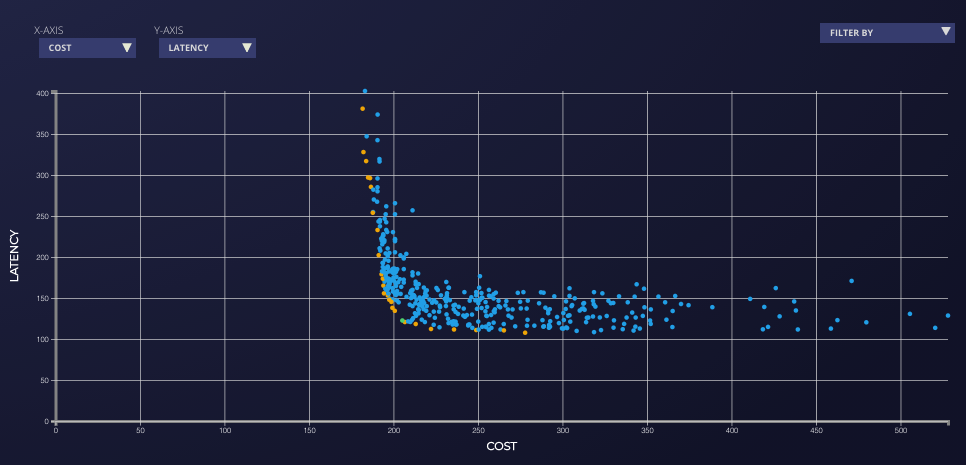

# HPA optimization using Locust

To allow the controller to patch the deployments and the HPA during the experiment, generate the proper RBAC permissions by running the following:
`redskyctl generate rbac -f experiment.yaml | kubectl apply -f -`

The `experiment.yaml` file is the actual experiment object manifest; this includes the definition of the experiment itself (in terms of assignable parameters and observable metrics) and the instructions for carrying out the experiment.

## Experiment lifecycle

For each trial, we create a locust load test using the [locust trial pod](https://github.com/thestormforge/optimize-trials/tree/main/locust) and `locustfile.py`.

Environment variables of the trial pod are used to configure the load test. The load test is 180 seconds long, uses 500 clients that are added at a rate of 50 client/second.
```
containers:
- env:
  - name: HOST
    value: http://voting-service
  - name: NUM_USERS
    value: "500"
  - name: SPAWN_RATE
    value: "50"
  - name: RUN_TIME
    value: "180"
  image: thestormforge/optimize-trials:v0.0.1-locust
  name: locust
```

You can increase this rate to make sure that your HPA scales fast enough to increase in load.
[However, with a kubernetes version lower than `v1.18` you cannot change the scaling policies through the `v2beta2` API](https://kubernetes.io/docs/tasks/run-application/horizontal-pod-autoscale/). In this experiment, we are going to optimize for the `target CPU utilization` that the HPA uses to scale the `voting-service`  deployment.

We optimize (minimization) for `cost` and `p95-latency`. We also track `failures_per_s` without optimizing for it. We set a max latency of 500 milliseconds.
```
- minimize: true
  name: p95-latency
  query: scalar(p95{job="trialRun",instance="{{ .Trial.Name }}"})
  type: prometheus
  max: "500"
```
If locust measures an p95 latency over the length of the load test (aka trial) higher than this value, we will report this trial as failed. Similarly, we set a maximum for `failures_per_s` we want a trial to report.
```
- minimize: true
  name: failures_per_s
  optimize: false
  query: scalar(failures_per_s{job="trialRun",instance="{{ .Trial.Name }}"})
  type: prometheus
```
An error rate higher than this value will fail the trial.

Launch the experiment using:
`kustomize build . | kubect apply -n <my-namespace> -f -`

You can visualize the progress of the experiment at `https://app.stormforge.io`. You should see something similar to this:


