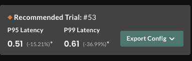
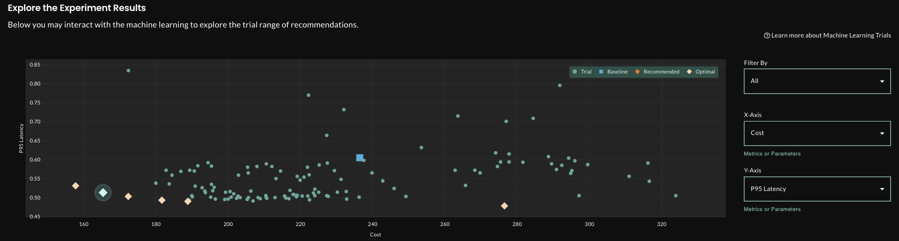
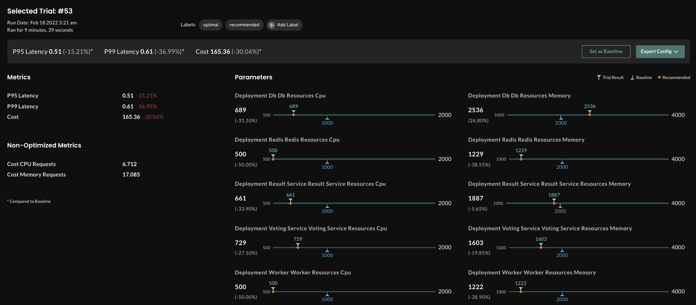

# Voting Webapp optimized using Tricentis Neoload Web Load Testing

## Overview

The goal of this example is to optimize the [voting webapp](https://github.com/thestormforge/examples/tree/master/voting-webapp) using [Tricentis Neoload](https://neoload.saas.neotys.com/) as load test tool. 

In this experiment, the load test is performed by the SaaS version of [Tricentis Neoload](https://neoload.saas.neotys.com/). This allows us to better simulate real-life traffic load on the application.

## Prerequisites

You must have a Kubernetes cluster. We recommend using a cluster with 4 nodes, 16 vCPUs (4 on each node) and 32GB of memory (8 on each node). Additionally, you will need a local configured copy of `kubectl`.

Additionally, you will need a local configured copy of `kubectl` and to initialize StormForge Optimize in your cluster. You can download a binary for your platform from the [installation guide](https://docs.stormforge.io/optimize/getting-started/install/) and run `stormforge init` (while connected to your cluster).

To use the run-experiment.sh script, you also need the uuidgen package pre-installed. 

## Run the experiment
### Deploy the voting webapp with ingress

Because the load test resides outside of the cluster, the voting webapp needs to be exposed with a publicly accessible IP address.

Run:
`kubectl apply -f application.yaml  `

### Set Neoload authentication token
The Neoload authentication token is defined as a kubernetes Secret neoload-token in experiment.yaml.  You need to update it with your own token issued by Tricentis. 

### Launch an experiment
The run-experiment.sh script fully automates the experiment. You will need to set your kubernetes context for the namespace you are working in with the voting-webapp. You will then need to specify the number of trials you would like to run when prompted. The default is 20. 

Run:
`./run-experiment.sh`

### Monitor the experiment progress and results

The best way to monitor the experiment progress is to use the [web based dashboard](https://app.stormforge.io/)

You can also access the status of the trials using the `kubectl` command line tool.

```
❯ kubectl get trials
NAME                       STATUS      ASSIGNMENTS                                                                                                                                                                                                                                                                                                                                                                                                                                                                                                                   VALUES
neoload-1da099b3e4d7-000   Completed   deployment/db/db/resources/cpu=1000, deployment/db/db/resources/memory=2000, deployment/redis/redis/resources/cpu=1000, deployment/redis/redis/resources/memory=2000, deployment/result-service/result-service/resources/cpu=1000, deployment/result-service/result-service/resources/memory=2000, deployment/voting-service/voting-service/resources/cpu=1000, deployment/voting-service/voting-service/resources/memory=2000, deployment/worker/worker/resources/cpu=1000, deployment/worker/worker/resources/memory=2000   p95-latency=0.46, p99-latency=0.71, cost=236.41456000000002, cost-cpu-requests=10.175, cost-memory-requests=21.14652
neoload-1da099b3e4d7-001   Completed   deployment/db/db/resources/cpu=1995, deployment/db/db/resources/memory=3008, deployment/redis/redis/resources/cpu=582, deployment/redis/redis/resources/memory=1198, deployment/result-service/result-service/resources/cpu=1052, deployment/result-service/result-service/resources/memory=3533, deployment/voting-service/voting-service/resources/cpu=891, deployment/voting-service/voting-service/resources/memory=1817, deployment/worker/worker/resources/cpu=1296, deployment/worker/worker/resources/memory=1068     p95-latency=0.476, p99-latency=0.797, cost=251.592520832, cost-cpu-requests=11.364999999999998, cost-memory-requests=19.462506944
neoload-1da099b3e4d7-002   Running     deployment/db/db/resources/cpu=1570, deployment/db/db/resources/memory=1851, deployment/redis/redis/resources/cpu=506, deployment/redis/redis/resources/memory=1499, deployment/result-service/result-service/resources/cpu=1140, deployment/result-service/result-service/resources/memory=1493, deployment/voting-service/voting-service/resources/cpu=1179, deployment/voting-service/voting-service/resources/memory=1182, deployment/worker/worker/resources/cpu=1165, deployment/worker/worker/resources/memory=3388    
```

## Technical Process
The experiment is fully automated as defined in the experiment.yaml 

In the experiment spec, you can see the parameters we are using for our experiment. 

```
spec:
  optimization:
  - name: "experimentBudget"
    value: "BUDGET"  
  parameters:
  - name: deployment/db/db/resources/cpu
    baseline: 1000
    min: 500
    max: 2000
  - name: deployment/db/db/resources/memory
    baseline: 2000
    min: 1000
    max: 4000
  - name: deployment/redis/redis/resources/cpu
    baseline: 1000
    min: 500
    max: 2000
  - name: deployment/redis/redis/resources/memory
    baseline: 2000
    min: 1000
    max: 4000
  - name: deployment/result-service/result-service/resources/cpu
    baseline: 1000
    min: 500
    max: 2000
  - name: deployment/result-service/result-service/resources/memory
    baseline: 2000
    min: 1000
    max: 4000
  - name: deployment/voting-service/voting-service/resources/cpu
    baseline: 1000
    min: 500
    max: 2000
  - name: deployment/voting-service/voting-service/resources/memory
    baseline: 2000
    min: 1000
    max: 4000
  - name: deployment/worker/worker/resources/cpu
    baseline: 1000
    min: 500
    max: 2000
  - name: deployment/worker/worker/resources/memory
    baseline: 2000
    min: 1000
    max: 4000
```


Next, we need to define the metrics or objectives we are optimizing for. 

```
  metrics:
  - name: p95-latency
    type: prometheus
    minimize: true
    query: scalar(p95{job="trialRun",instance="{{ .Trial.Name }}"})
  - name: p99-latency
    type: prometheus
    minimize: true
    query: scalar(p99{job="trialRun",instance="{{ .Trial.Name }}"})
  - name: cost
    type: prometheus
    minimize: true
    query: ({{ cpuRequests . "" }} * 17) + ({{ memoryRequests . "" | GB }} * 3)
  - name: cost-cpu-requests
    type: prometheus
    minimize: true
    optimize: false
    query: '{{ cpuRequests . "" }}'
  - name: cost-memory-requests
    type: prometheus
    minimize: true
    optimize: false
    query: '{{ memoryRequests . "" | GB }}'
 
```

Please note that the cost is calculated based on the CPU and Memory consumed in that trial.

Finally, we define our patches and our trial template.

```
 patches:
  - targetRef:
      name: db
      namespace: default
      apiVersion: apps/v1
      kind: Deployment
    patch: |
      spec:
        template:
          spec:
            containers:
            - name: db
              resources:
                limits:
                  cpu: '{{ index .Values "deployment/db/db/resources/cpu" }}m'
                  memory: '{{ index .Values "deployment/db/db/resources/memory" }}Mi'
                requests:
                  cpu: '{{ index .Values "deployment/db/db/resources/cpu" }}m'
                  memory: '{{ index .Values "deployment/db/db/resources/memory" }}Mi'
  - targetRef:
      name: redis
      namespace: default
      apiVersion: apps/v1
      kind: Deployment
    patch: |
      spec:
        template:
          spec:
            containers:
            - name: redis
              resources:
                limits:
                  cpu: '{{ index .Values "deployment/redis/redis/resources/cpu" }}m'
                  memory: '{{ index .Values "deployment/redis/redis/resources/memory" }}Mi'
                requests:
                  cpu: '{{ index .Values "deployment/redis/redis/resources/cpu" }}m'
                  memory: '{{ index .Values "deployment/redis/redis/resources/memory" }}Mi'
  - targetRef:
      name: result-service
      namespace: default
      apiVersion: apps/v1
      kind: Deployment
    patch: |
      spec:
        template:
          spec:
            containers:
            - name: result-service
              resources:
                limits:
                  cpu: '{{ index .Values "deployment/result-service/result-service/resources/cpu"
                    }}m'
                  memory: '{{ index .Values "deployment/result-service/result-service/resources/memory"
                    }}Mi'
                requests:
                  cpu: '{{ index .Values "deployment/result-service/result-service/resources/cpu"
                    }}m'
                  memory: '{{ index .Values "deployment/result-service/result-service/resources/memory"
                    }}Mi'
  - targetRef:
      name: voting-service
      namespace: default
      apiVersion: apps/v1
      kind: Deployment
    patch: |
      spec:
        template:
          spec:
            containers:
            - name: voting-service
              resources:
                limits:
                  cpu: '{{ index .Values "deployment/voting-service/voting-service/resources/cpu"
                    }}m'
                  memory: '{{ index .Values "deployment/voting-service/voting-service/resources/memory"
                    }}Mi'
                requests:
                  cpu: '{{ index .Values "deployment/voting-service/voting-service/resources/cpu"
                    }}m'
                  memory: '{{ index .Values "deployment/voting-service/voting-service/resources/memory"
                    }}Mi'
  - targetRef:
      name: worker
      namespace: default
      apiVersion: apps/v1
      kind: Deployment
    patch: |
      spec:
        template:
          spec:
            containers:
            - name: worker
              resources:
                limits:
                  cpu: '{{ index .Values "deployment/worker/worker/resources/cpu" }}m'
                  memory: '{{ index .Values "deployment/worker/worker/resources/memory"
                    }}Mi'
                requests:
                  cpu: '{{ index .Values "deployment/worker/worker/resources/cpu" }}m'
                  memory: '{{ index .Values "deployment/worker/worker/resources/memory"
                    }}Mi'
  trialTemplate:            
```

You can see here how we are patching the voting-service deployment for CPU and memory allocation. You can also see here that we use the custom neoload-trials container image for load generation. We can validate our trial patch by describing a voting-service pod and verifying the trial settings by describing the trial 

```                                                                                                                  
kubectl describe pod voting-service-78cfdcbdb6-4qdpx
Name:         voting-service-78cfdcbdb6-4qdpx
Namespace:    default
Priority:     0
Node:         ip-192-168-20-63.us-east-2.compute.internal/192.168.20.63
Start Time:   Fri, 25 Feb 2022 15:32:29 -0600
Labels:       app=voting-app
              component=voting-service
              pod-template-hash=78cfdcbdb6
Annotations:  kubernetes.io/psp: eks.privileged
Status:       Running
IP:           192.168.13.238
IPs:
  IP:           192.168.13.238
Controlled By:  ReplicaSet/voting-service-78cfdcbdb6
Containers:
  voting-service:
    Container ID:   docker://abafc58b697620c8055b63e34e6f9fe5d62c6898b57fc64d0a843f8394249f6f
    Image:          dockersamples/examplevotingapp_vote
    Image ID:       docker-pullable://dockersamples/examplevotingapp_vote@sha256:b4e60557febfed6d345a09e5dce52aeeff997b7c16a64428ccf5f3d8f3c60dde
    Port:           80/TCP
    Host Port:      0/TCP
    State:          Running
      Started:      Fri, 25 Feb 2022 15:32:30 -0600
    Ready:          True
    Restart Count:  0
    Limits:
      cpu:     891m
      memory:  1817Mi
    Requests:
      cpu:        891m
      memory:     1817Mi
    Readiness:    http-get http://:80/ delay=5s timeout=1s period=5s #success=1 #failure=3
    Environment:  <none>
    Mounts:
      /var/run/secrets/kubernetes.io/serviceaccount from default-token-mdbpw (ro)
Conditions:
  Type              Status
  Initialized       True 
  Ready             True 
  ContainersReady   True 
  PodScheduled      True 
Volumes:
  default-token-mdbpw:
    Type:        Secret (a volume populated by a Secret)
    SecretName:  default-token-mdbpw
    Optional:    false
QoS Class:       Guaranteed
Node-Selectors:  <none>
Tolerations:     node.kubernetes.io/not-ready:NoExecute op=Exists for 300s
                 node.kubernetes.io/unreachable:NoExecute op=Exists for 300s
...
```
```
kubectl describe trial neoload-1da099b3e4d7-001
Name:         neoload-1da099b3e4d7-001
Namespace:    default
Labels:       stormforge.io/application=default
              stormforge.io/experiment=neoload-1da099b3e4d7
              stormforge.io/objective=default
              stormforge.io/scenario=default
Annotations:  stormforge.io/report-trial-url: https://api.stormforge.dev/v1/experiments/neoload-1da099b3e4d7/trials/1
API Version:  optimize.stormforge.io/v1beta2
Kind:         Trial
Metadata:
  Creation Timestamp:  2022-02-25T21:31:57Z
  Finalizers:
    serverFinalizer.stormforge.io
    setupFinalizer.stormforge.io
  Generate Name:  neoload-1da099b3e4d7-
  Generation:     26
...
  Assignments:
    Name:   deployment/db/db/resources/cpu
    Value:  1995
    Name:   deployment/db/db/resources/memory
    Value:  3008
    Name:   deployment/redis/redis/resources/cpu
    Value:  582
    Name:   deployment/redis/redis/resources/memory
    Value:  1198
    Name:   deployment/result-service/result-service/resources/cpu
    Value:  1052
    Name:   deployment/result-service/result-service/resources/memory
    Value:  3533
    Name:   deployment/voting-service/voting-service/resources/cpu
    Value:  891
    Name:   deployment/voting-service/voting-service/resources/memory
    Value:  1817
    Name:   deployment/worker/worker/resources/cpu
    Value:  1296
    Name:   deployment/worker/worker/resources/memory
    Value:  1068
  Experiment Ref:
    Name:       neoload-1da099b3e4d7
    Namespace:  default
  Job Template:
    Metadata:
      Creation Timestamp:  2022-02-25T21:31:57Z
      Labels:
        stormforge.io/application:  default
        stormforge.io/objective:    default
        stormforge.io/scenario:     default
    Spec:
      Template:
        Metadata:
          Creation Timestamp:  2022-02-25T21:31:57Z
          Labels:
            stormforge.io/application:  default
            stormforge.io/objective:    default
            stormforge.io/scenario:     default
        Spec:
          Containers:
            Env:
              Name:  TEST_NAME
              Value From:
                Field Ref:
                  Field Path:  metadata.name
              Name:            LGS
              Value:           5
              Name:            TEST_FILE
              Value:           /forge-init.d/neoload-stormforge.yaml
              Name:            NEOLOAD_TOKEN
              Value From:
                Secret Key Ref:
                  Key:   token
                  Name:  neoload-token
            Image:       richardincyberspace/neoload-trials
            Name:        neoload
            Resources:
            Volume Mounts:
              Mount Path:  /forge-init.d
              Name:        test-case-file
              Read Only:   true
          Volumes:
            Config Map:
              Name:            default-neoload
            Name:              test-case-file
  Setup Service Account Name:  optimize-setup
  Setup Tasks:
    Args:
      prometheus
      $(MODE)
    Name:                      monitoring
  Ttl Seconds After Failure:   172800
  Ttl Seconds After Finished:  14400
Status:
  Assignments:  deployment/db/db/resources/cpu=1995, deployment/db/db/resources/memory=3008, deployment/redis/redis/resources/cpu=582, deployment/redis/redis/resources/memory=1198, deployment/result-service/result-service/resources/cpu=1052, deployment/result-service/result-service/resources/memory=3533, deployment/voting-service/voting-service/resources/cpu=891, deployment/voting-service/voting-service/resources/memory=1817, deployment/worker/worker/resources/cpu=1296, deployment/worker/worker/resources/memory=1068
  ...
    Target Ref:
      API Version:  apps/v1
      Kind:         Deployment
      Name:         worker
      Namespace:    default
  Phase:            Running
  Readiness Checks:
    Condition Types:
      stormforge.io/app-ready
    Initial Delay Seconds:  1
    Period Seconds:         5
    Target Ref:
      API Version:  apps/v1
      Kind:         Deployment
      Name:         db
      Namespace:    default
    Condition Types:
      stormforge.io/app-ready
    Initial Delay Seconds:  1
    Period Seconds:         5
    Target Ref:
      API Version:  apps/v1
      Kind:         Deployment
      Name:         redis
      Namespace:    default
    Condition Types:
      stormforge.io/app-ready
    Initial Delay Seconds:  1
    Period Seconds:         5
    Target Ref:
      API Version:  apps/v1
      Kind:         Deployment
      Name:         result-service
      Namespace:    default
    Condition Types:
      stormforge.io/app-ready
    Initial Delay Seconds:  1
    Period Seconds:         5
    Target Ref:
      API Version:  apps/v1
      Kind:         Deployment
      Name:         voting-service
      Namespace:    default
    Condition Types:
      stormforge.io/app-ready
    Initial Delay Seconds:  1
    Period Seconds:         5
    Target Ref:
      API Version:  apps/v1
      Kind:         Deployment
      Name:         worker
      Namespace:    default
  Start Time:       2022-02-25T21:32:42Z
  Values:           
Events:             <none>
```

## Results
The image below shows us that the Machine Learning engine has recommended trial number #53. With this trial, we can see we have a p99 latency reduction by 37% and p95 latency reduction reduction by 15%
compared to our baseline in Trial #0.



In this image, we can see all of our trials, with the recommended trial highlighted.



And finally, we can get the parameter settings or export the config itself

